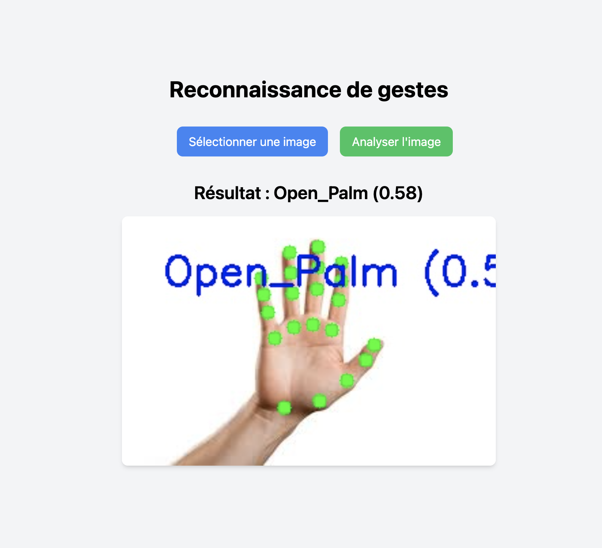

# Gesture Detection 

## Technologies Used
- **Python**: Core programming language.
- **Flask**: Web framework for serving the results and chatbot.
- **HTML/Tailwind CSS**: Frontend.

## Installation
### Prerequisites
Ensure you have Python installed (>= 3.8) and necessary dependencies.

### Steps
1. Clone this repository:
   ```bash
   git clone <link>
   cd your-repo
   ```
2. Install dependencies:
   ```bash
   pip install -r requirements.txt
   ```
3. Run the application:
   ```bash
   python app.py
   ```
4. Open your browser and go to `http://localhost:5000` to use the tool.

## Preview



## License
This project is licensed under the MIT License.
